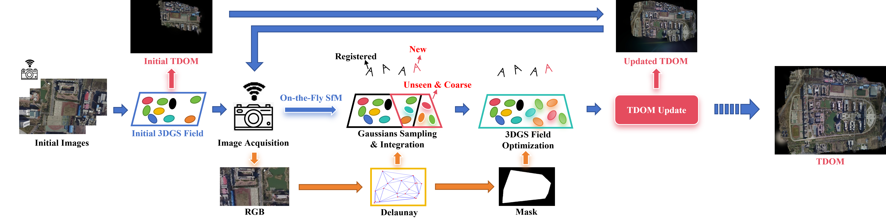

# A-TDOM: Active TDOM via On-the-Fly 3DGS
Yiwei Xu, Xiang Wang, Yifei Yu, Wentian Gan, Luca Morelli, Giulio Perda, Xiongwu Xiao, Zongqian Zhan, Xin Wang, and Fabio Remondino

[](https://arxiv.org/abs/2509.12759)


## Cloning the Repository

```shell
# SSH
git clone git@github.com:xywjohn/A-TDOM.git --recursive
```
or
```shell
# HTTPS
git clone https://github.com/xywjohn/A-TDOM --recursive
```

After that, please manually decompress the diff-gaussian-rasterization.zip, fused-ssim.zip and simple-knn.zip archive located under the submodules directory.

## Setup

```shell
cd .../A-TDOM
conda env create --file environment.yml
conda activate ATDOM

pip install pytorch3d
pip install open3d
pip install opencv-python
```

## Data Preparation
Since this project aims to enable simultaneous image acquisition and 3D Gaussian Splatting (3DGS) training, we need to utilize the [On-The-Fly SfM](https://github.com/sygant/onthefly/issues/2) system proposed by Zhan et al. This system has already achieved the capability of near real-time image acquisition and camera pose estimation. In this project, we will leverage the camera poses and sparse point clouds provided by this system as the input for subsequent 3DGS training.

You can use your own data or the test data provided by us (demo_data/data1 and On-The-Fly/data1) to perform processing with the On-The-Fly SfM system. You can download our data [here](https://drive.google.com/drive/folders/1X3KiQR_bva6nUXQEznZqgHbkam91kCVB?usp=drive_link) and place all the data into the folder with the same name in this project directory. Next, please configure the parameters ```DatasetName```, ```SourceImageDataset```, and ```On_The_Fly_Dataset``` in the ```DatasetPrepare.py``` to the corresponding dataset names or paths. For example, if you intend to use the dataset provided by us directly, please set them as follows:

```shell
DatasetName = ['data1']
SourceImageDataset = r".../demo_data"
On_The_Fly_Dataset = r".../On-The-Fly" # where you save On-The-Fly SfM Results
```

And then you have to run ```DatasetPrepare.py```:

```shell
python DatasetPrepare.py
```

This will produce results as illustrated below:

*****************************************

.../On-The-Fly/data1  
=>16  
||===>images  
||===||===>10002.jpg  
||===||===>10005.jpg  
||===||===>......  
||===>sparse  
||===||===>0  
||=========||===>cameras.bin  
||=========||===>imageMatchMatrix.txt  
||=========||===>images.bin  
||=========||===>imagesNames.txt  
||=========||===>points3D.bin  
=>17  
||===>images  
||===||===>10002.jpg  
||===||===>10005.jpg  
||===||===>......  
||===>sparse  
||===||===>0   
||=========||===>cameras.bin  
||=========||===>imageMatchMatrix.txt  
||=========||===>images.bin  
||=========||===>imagesNames.txt  
||=========||===>points3D.bin  
=>18  
||  ......  
=>19  
||  ......  
=>20  
||  ......  
=>21  
||  ......  

......

*****************************************

## 3DGS Train

```Source_Path_Dir``` should specify the directory that contains all image data, camera pose information, and sparse point cloud. ```Model_Path_Dir``` should specify the output directory for the 3DGS results. The output frequency of 3DGS can be configured by using different command-line arguments.

```shell
python ContinuosProgressiveTrain4.py --Source_Path_Dir .../On-The-Fly/data1 --Model_Path_Dir .../OutputDir --FinalOptimizationIterations 4000 --StartFromImageNo 30 --OriginImageHeight 1080 --OriginImageWidth 1920 --points_per_triangle 30 --Use_Tri_Mask
```

<details>
<summary><span style="font-weight: bold;">Necessary command Line Arguments for ContinuosProgressiveTrain4.py</span></summary>

  #### --Source_Path_Dir {str}
  Path to the source directory containing all image data, camera pose information, and sparse point cloud.
  #### --Model_Path_Dir {str}
  Path where the trained model should be stored.
  #### --IterationFirstScene {int}
  Training iterations for initial training phase.
  #### --FinalOptimizationIterations {int}
  Training iterations for final refinement phase.
  #### --StartFromImageNo {int}
  It indicates from which image the progressive training begins. This image and all the images before it are used for scene initialization.
  #### --OriginImageHeight {int}
  The original image height input into On-Fly SfM.
  #### --OriginImageWidth {int}
  The original image width input into On-Fly SfM.
  #### --points_per_triangle {int}
  The number of points collected in each triangle when conducting point sampling based on the Delunay triangulation.
  #### --ProgressiveModelOutput
  Save gaussians before a new image is acquired.

</details>

<details>
<summary><span style="font-weight: bold;">Optional command Line Arguments for ContinuosProgressiveTrain4.py</span></summary>

  #### --GetDemo
  If you want to obtain a Demo about progressive training, use this command.
  #### --render_TDOM 
  If you want to obtain the TDOM each time you add a new image, use this command.
  #### --TDOM_FoVx {float}
  Control the field of view during TDOM generation, with a value not exceeding 3.14.
  #### --render_target
  If you want to render a specific view after each acquisition of a new image, use this command.
  #### --NoDebug
  If you wish to only train the model without performing any other operations, use this instruction.

</details>

## TDOM Generation

If you want to generate TDOM while training 3DGS field, please use 2 commonds: ```--render_TDOM``` and ```--TDOM_FoVx``` from ```Optional command Line Arguments for ContinuosProgressiveTrain4.py```. Meanwhile, please modify the parameters T and R in ContinuosProgressiveTrain4.py => GaussianTrainer class => render_TDOM function. Here, T represents the 3D coordinates of the camera, R represents the camera's rotation matrix, and ```--TDOM_FoVx``` specifies the camera's field of view. If you wish to generate the TDOM for the entire scene, it is recommended to select a camera located near the center of the scene and to increase the field of view.

```shell
python ContinuosProgressiveTrain4.py --Source_Path_Dir .../On-The-Fly/data1 --Model_Path_Dir .../OutputDir --FinalOptimizationIterations 4000 --StartFromImageNo 30 --OriginImageHeight 1080 --OriginImageWidth 1920 --points_per_triangle 30 --Use_Tri_Mask --render_TDOM --TDOM_FoVx 3.00

```

## BibTeX
```
@misc{xu2025atdomactivetdomonthefly,
      title={A-TDOM: Active TDOM via On-the-Fly 3DGS}, 
      author={Yiwei Xu and Xiang Wang and Yifei Yu and Wentian Gan and Luca Morelli and Giulio Perda and Xiongwu Xiao and Zongqian Zhan and Xin Wang and Fabio Remondino},
      year={2025},
      eprint={2509.12759},
      archivePrefix={arXiv},
      primaryClass={cs.CV},
      url={https://arxiv.org/abs/2509.12759}, 
}
```


